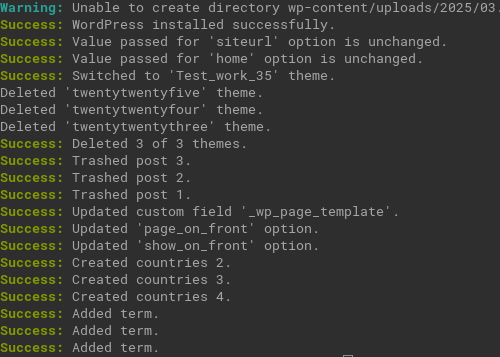
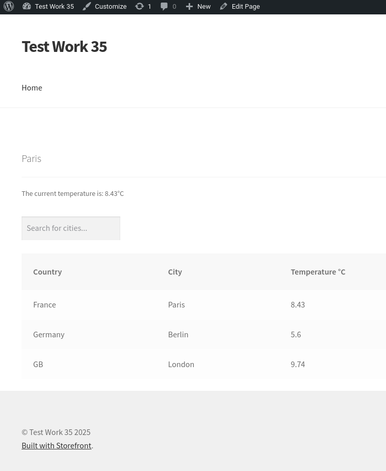

# Тестовое задание для AbeloHost

Инициализация среды происходит с помощью docker, на компьютере должны быть установлены `docker` и `docker-compose`. 

Первичная настройка, установка темы происходит с помощью wp cli, выполнением скрипта в контейнере. Ниже инструкция по развертыванию.

Помимо кастомных полей из задания было добавлено еще одно - `id`.
Это идентификатор города в `openweathermap`, нужен для того, чтобы запрашивать данные о погоде о всех городах за раз.
Если это поле не заполнить, будет отдельный запрос к апи для такого города.

## Запуск проекта

Нужно создать `.env` файл, можно просто переименовать `.env.example`.

Если заняты порты `8080` и `33066`, нужно указать другие в `.env` в переменных `APP_PORT` и `FORWARD_DB_PORT`.

Далее сборка и запуск контейнера с приложением wordpress и базой к нему. 

```shell
docker-compose up --build -d

docker exec -it abelo-app sh -c 'sh < wp_init.sh'
```

Результат выполнения wp_init.sh:



После этого сайт работает и наполнен тестовыми данными, можно авторизоваться по адресу `http://localhost:8080/wp-login.php`
логин `admin`, пароль `password` (если не менялись в .env).

Добавить виджет нужно вручную:

Находясь на главной странице нажать в шапке `Customize` → `Widgets` → `Below header`
→ `+` → `Legacy Widget` → `City weather` и нажать `Publish`

После добавления виджета главная страница выглядит так:



**Замечание по docker volume:**

Для редактирования `themes` пользователь должен быть в группе `www-data`.

Добавить его туда можно так:

```shell
usermod -aG www-data $USER
```

# Задание

Создать пользовательский тип записи (Custom Post Type) под названием “Cities”. 

На странице редактирования записи создать метабокс с произвольными полями (Custom Post 
Fields) “latitude” и “longitude”, для ввода широты и долготы города соответственно. 
При необходимости создать дополнительные поля.

Создать пользовательскую таксономию (Custom Taxonomy) “Countries” и прикрепить ее к 
“Cities”.

Создать виджет, в настройках которого можно выбрать город из custom post type “Cities”, 
виджет должен показывать название города и текущую температуру используя сторонний API 
(например OpenWeatherMap).

На отдельной странице с кастомным шаблоном (custom page template) вывести таблицу со 
списком стран, городов и температурой. Получение данных для таблицы реализовать 
с помощью запроса к базе данных, используя глобальную переменную $wpdb. 
Над таблицей добавить поле для поиска по городам через wp ajax. 
До и после таблицы добавить custom action hook.

## Требования к выполнению

Использовать тему Storefront (https://wordpress.org/themes/storefront/). 
Все правки выполнять в дочерней теме.

Нельзя использовать плагины для выполнения задания.

Весь код должен быть документирован.

Писать оптимизированный и производительный код.

Файловая структура проекта должна быть организована и логична.